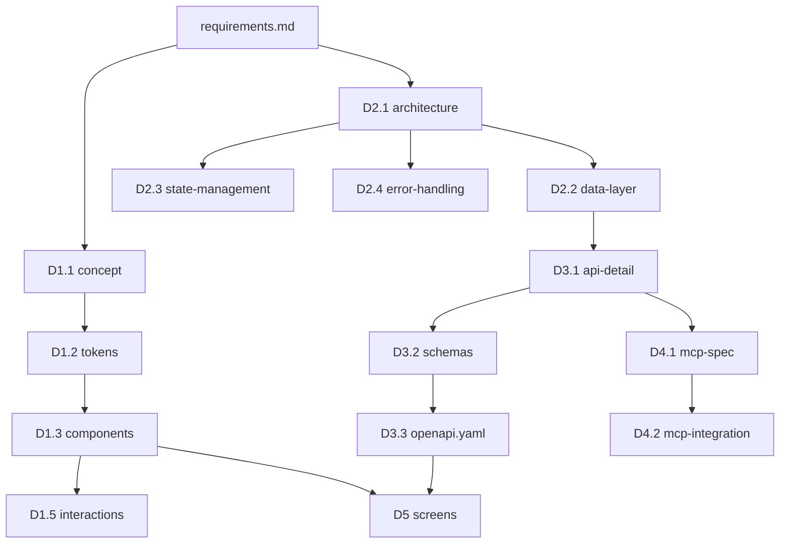

# design/README.md テンプレート（設計書総目次）

対象リポジトリの `docs/design/README.md` のひな形。

```markdown
# 設計書 総目次

最終更新: YYYY-MM-DD
対象: {プロダクト名}
前提: [requirements.md](../requirements.md) / [design-plan.md](../design-plan.md)

## ドキュメント一覧

| カテゴリ | ID | ファイル | 状態 | 概要 |
|---------|----|---------|------|------|
| UI/UX | D1.1 | [concept.md](./concept.md) | ⬜/✅ | デザインコンセプト |
| UI/UX | D1.2 | [tokens.md](./tokens.md) | ⬜ | デザイントークン |
| UI/UX | D1.3 | [components.md](./components.md) | ⬜ | コンポーネントカタログ |
| UI/UX | D1.4 | — | ⬜ | 画面モック（frontend-design） |
| UI/UX | D1.5 | [interactions.md](./interactions.md) | ⬜ | マイクロインタラクション |
| システム | D2.1 | [architecture.md](./architecture.md) | ⬜ | アーキテクチャ |
| システム | D2.2 | [data-layer.md](./data-layer.md) | ⬜ | データ層 |
| システム | D2.3 | [state-management.md](./state-management.md) | ⬜ | 状態管理 |
| システム | D2.4 | [error-handling.md](./error-handling.md) | ⬜ | エラーハンドリング |
| API | D3.1 | [api-detail.md](./api-detail.md) | ⬜ | API詳細 |
| API | D3.2 | [schemas.md](./schemas.md) | ⬜ | Pydantic/Zodスキーマ |
| API | D3.3 | [../openapi.yaml](../openapi.yaml) | ⬜ | OpenAPI 3.1ドラフト |
| MCP | D4.1 | [mcp-spec.md](./mcp-spec.md) | ⬜ | MCP仕様 |
| MCP | D4.2 | [mcp-integration.md](./mcp-integration.md) | ⬜ | MCP統合 |

**進捗**: 0 / 13

## 依存関係



## 役割別の読み順

- **初見**: requirements → concept → architecture → api-detail → screens
- **フロント担当**: concept → tokens → components → interactions → state-management → error-handling → api-detail
- **バック担当**: architecture → data-layer → api-detail → schemas → openapi.yaml → error-handling
- **MCP担当**: architecture → api-detail → mcp-spec → mcp-integration
- **レビュアー**: requirements → この README → 各ドキュメント冒頭の「設計原則」のみ

## 重要な横断決定事項

各設計書で決まった、**複数ドキュメントに影響する決定**をここに集約する。個別ドキュメントには具体仕様を、ここには要約と出典を書く。

### UI原則
- （例: 「カラーパレットはモノトーン中心、アクセント1色のみ」— 出典: concept.md §2）

### アーキテクチャ原則
- （例: 「フロントは BFF なしの直通。認証は Cookie セッション」— 出典: architecture.md §3）

### データ層原則
- （例: 「サーバー状態は TanStack Query、UI状態は Zustand。両者を混ぜない」— 出典: state-management.md §1）

### API原則
- （例: 「ID は ULID。エラーは RFC 7807 problem+json」— 出典: api-detail.md §4）

## メンテナンスルール

- 新しい設計書を追加したら、このファイルの一覧表と依存関係図を必ず更新する
- 横断決定が発生したら §重要な横断決定事項 に追記する（個別ドキュメントだけに書かない）
- 状態列 (⬜/🔄/✅) は design-plan.md と同期させる
```

---

# 各設計書のひな形

以下の13本（D4.x は任意）の雛形は、同ディレクトリの対応ファイルに個別にある。

- [concept-template.md](./concept-template.md) — D1.1
- [tokens-template.md](./tokens-template.md) — D1.2
- [components-template.md](./components-template.md) — D1.3
- [interactions-template.md](./interactions-template.md) — D1.5
- [architecture-template.md](./architecture-template.md) — D2.1
- [data-layer-template.md](./data-layer-template.md) — D2.2
- [state-management-template.md](./state-management-template.md) — D2.3
- [error-handling-template.md](./error-handling-template.md) — D2.4
- [api-detail-template.md](./api-detail-template.md) — D3.1
- [schemas-template.md](./schemas-template.md) — D3.2
- [openapi-template.md](./openapi-template.md) — D3.3
- [mcp-spec-template.md](./mcp-spec-template.md) — D4.1
- [mcp-integration-template.md](./mcp-integration-template.md) — D4.2

## 各設計書の共通構造

全13本に以下の骨格を適用する。

```markdown
# {タイトル}（D{x.y}）

- 対象: {対象範囲}
- 作成日: YYYY-MM-DD
- フェーズID: D{x.y}
- 関連: [requirements.md](../requirements.md) / [前のドキュメント] / [次のドキュメント]
- 状態: draft / review / approved

## 1. 設計原則

- 原則1
- 原則2
- 原則3

## 2. 詳細仕様

（型定義・関数シグネチャ・エラー時挙動まで書く。「このまま実装に落とせる」を基準に）

## 3. テスト戦略

- 単体 / 結合 / E2E の範囲
- カバレッジ目標

## 4. 実装順序

- このドキュメントの内容を実装する推奨順

## 5. 次のドキュメントへの引継ぎメモ

- 後続タスクが前提にすべき決定事項
- 未決のまま残した事項

## 6. 完了判定 (DoD)

- [ ] 判定基準1
- [ ] 判定基準2
```
