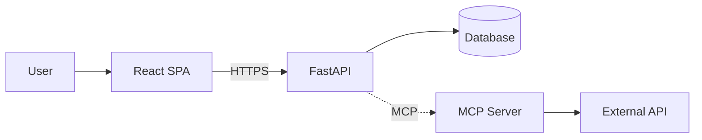

# architecture.md テンプレート（D2.1 システム全体像）

```markdown
# システム全体像 (D2.1)

- 対象: フロント / バック / DB / 外部サービスの配置と通信
- 作成日: YYYY-MM-DD
- 関連: [requirements.md](../requirements.md) → 本書 → [data-layer.md](./data-layer.md) / [api-detail.md](./api-detail.md)
- 状態: draft

## 1. 設計原則

- **BFF なし**の直通構成。フロントから API に直接リクエスト
- **シンプル優先**。層を増やさない
- 認証は {Cookie セッション / Bearer トークン}

## 2. コンポーネント構成図



## 3. リポジトリ構成

```
project/
├── backend/   FastAPI
├── frontend/  React + Vite
├── docs/      設計書・API仕様・画面仕様
└── docker-compose.yaml
```

## 4. デプロイ構成

| 環境 | フロント | バック | DB |
|------|---------|-------|----|
| 開発 | vite dev (5173) | uvicorn (8000) | SQLite file |
| 本番 | nginx static | uvicorn + gunicorn | PostgreSQL / SQLite |

## 5. 通信仕様の前提

- プロトコル: HTTPS
- API ベースパス: `/api`
- 認証: Cookie セッション（SameSite=Lax）
- CORS: 開発時のみ localhost:5173 を許可

## 6. 主要な非機能設計

| 項目 | 方針 |
|------|------|
| ログ | JSON構造化、request_id でフロント/バック紐付け |
| メトリクス | v1 では簡易（Prometheus は後回し） |
| エラートラッキング | Sentry（任意） |
| 秘密情報 | .env で管理、リポジトリ混入禁止 |

## 7. 引継ぎメモ

- D2.2 data-layer へ: DB 選定と ORM（SQLAlchemy / なし）を決める
- D3.1 api-detail へ: 認証方式と CORS ポリシーを前提に
- D4.1 mcp-spec へ: MCP 呼び出しはバックからのみ（フロントから直接呼ばない）

## 8. 完了判定 (DoD)

- [ ] Mermaid 構成図がある
- [ ] デプロイ環境表が埋まっている
- [ ] 認証方式・CORS・ログ方針が決まっている
```
