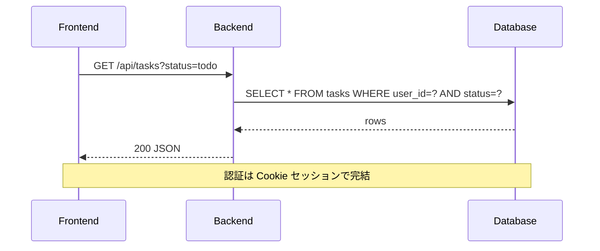

# data-layer.md テンプレート（D2.2 データ層詳細）

```markdown
# データ層詳細 (D2.2)

- 対象: DB スキーマ / マイグレーション / 読み書きフロー
- 作成日: YYYY-MM-DD
- 関連: [architecture.md](./architecture.md) → 本書 → [api-detail.md](./api-detail.md) / [schemas.md](./schemas.md)
- 状態: draft

## 1. 設計原則

- **ID は ULID**（時間順ソート可・衝突率低）
- 論理削除より物理削除を優先。削除は取り消し不能
- マイグレーションは Alembic（あるいは手書きSQL）
- N+1 を避ける。明示的に eager load

## 2. エンティティ一覧

| 名前 | 用途 | 主要フィールド |
|------|------|---------------|
| User | 利用者 | id, email, name, created_at |
| Tag | タグ | id, name, color |
| Task | タスク | id, title, status, tag_ids, created_at |
| ... | ... | ... |

## 3. スキーマ（SQL / SQLAlchemy）

```sql
CREATE TABLE users (
  id TEXT PRIMARY KEY,              -- ULID
  email TEXT UNIQUE NOT NULL,
  name TEXT NOT NULL,
  created_at TIMESTAMP NOT NULL
);

CREATE TABLE tasks (
  id TEXT PRIMARY KEY,
  user_id TEXT NOT NULL REFERENCES users(id),
  title TEXT NOT NULL,
  status TEXT NOT NULL CHECK (status IN ('todo','doing','done')),
  created_at TIMESTAMP NOT NULL
);

CREATE INDEX idx_tasks_user_status ON tasks(user_id, status);
```

## 4. 主要クエリと読み書きフロー



## 5. マイグレーション方針

- Alembic（自動生成 + 手修正）
- 破壊的変更は v{N+1} として段階移行
- 初期化スクリプト: `scripts/init_db.py`

## 6. 初期データ

- 開発用サンプル: タグ4件 + タスク8件（要求 §9 に準拠）
- 本番初期: 空

## 7. 引継ぎメモ

- D3.1 api-detail へ: ID は全て ULID、status は CHECK 制約値と一致させる
- D3.2 schemas へ: Pydantic 側の Literal 型をこの CHECK と揃える

## 8. 完了判定 (DoD)

- [ ] エンティティ一覧と SQL スキーマが書かれている
- [ ] 主要クエリのシーケンス図が1つ以上
- [ ] マイグレーション方針と初期データが決まっている
```
