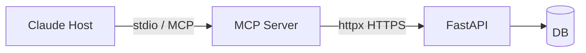
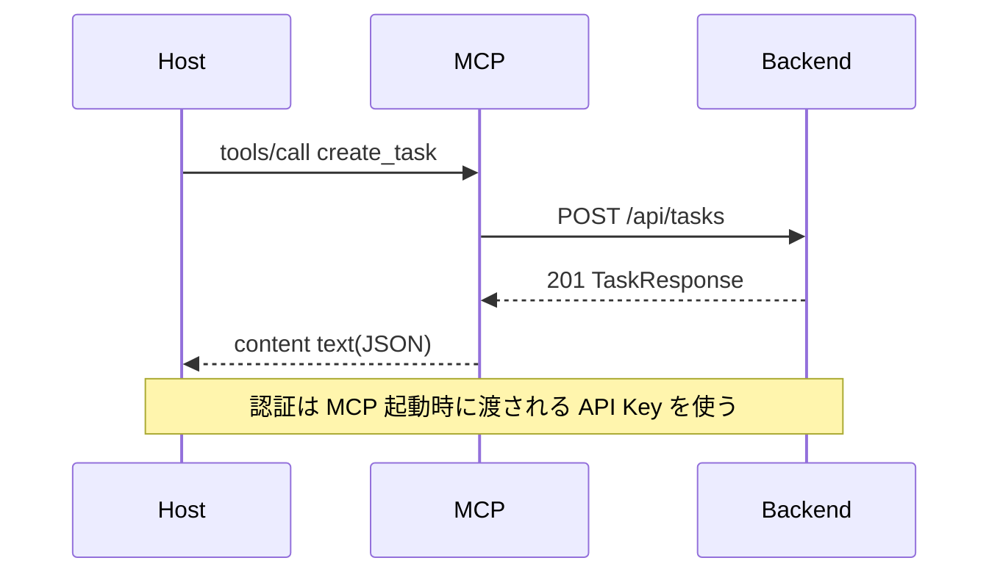

# mcp-integration.md テンプレート（D4.2 MCP統合・任意）

MCP 連携をするプロダクトのみ作成する。

```markdown
# MCP 統合 (D4.2)

- 対象: MCP サーバとバックエンド API の連携実装方針
- 作成日: YYYY-MM-DD
- 関連: [mcp-spec.md](./mcp-spec.md) / [architecture.md](./architecture.md)
- 状態: draft

## 1. 設計原則

- **MCP サーバはバック API の薄いラッパー**。ロジック重複を避ける
- 通信は **httpx（Python）** で同期/非同期両対応
- タイムアウト既定 5s、リトライなし（ホスト側で再実行される前提）

## 2. 構成図



## 3. 内部呼び出しフロー（例: create_task）



## 4. 実装方針

### ディレクトリ構成
```
mcp/
├── src/
│   ├── server.py         # MCP エントリポイント
│   ├── tools/            # Tool ごとにファイル分割
│   ├── resources/
│   ├── prompts/
│   └── client.py         # httpx ラッパー
├── pyproject.toml
└── README.md
```

### httpx クライアント（雛形）

```python
import httpx
from typing import Any

class BackendClient:
    def __init__(self, base_url: str, api_key: str) -> None:
        self._client = httpx.Client(
            base_url=base_url,
            headers={"X-API-Key": api_key},
            timeout=5.0,
        )

    def create_task(self, payload: dict[str, Any]) -> dict[str, Any]:
        resp = self._client.post("/api/tasks", json=payload)
        resp.raise_for_status()
        return resp.json()
```

## 5. エラーハンドリング

| 種別 | 扱い |
|------|------|
| 4xx | RFC 7807 の detail を text として返す |
| 5xx | 「バックエンドで予期しないエラー」を text、ログ出力 |
| タイムアウト | 「バックエンドが応答しません」を text |
| 接続拒否 | 同上 |

全て JSON-RPC error ではなく `content[0].type = "text"` で表現（ホスト UI が読みやすい）。

## 6. 配布

- PyPI 公開 or リポジトリ直接 clone
- `uvx run {パッケージ名}` で起動可能にする
- ホスト設定例（`claude_desktop_config.json`）をリポジトリに同梱

## 7. 引継ぎメモ

- 実装フェーズ: `python-impl` / `python-project-init`（type=command）を使う
- テスト: バック API をモックして Tools 単体テスト

## 8. 完了判定 (DoD)

- [ ] MCP ↔ バックの通信図が書かれている
- [ ] httpx クライアントの雛形がある
- [ ] エラー扱いが一覧化されている
- [ ] 配布方法が決まっている
```
