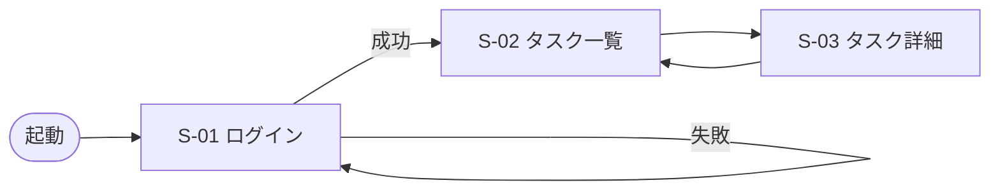

# docs/screens/ テンプレート（D5 画面仕様書・暫定版）

設計フェーズで作る**暫定版**。実装後は `screen-spec-reverse` スキルでコードから再生成して正式版にする。

## ディレクトリ構成

```
docs/screens/
├── index.md            # 画面一覧・遷移図
├── login.md            # 各画面の仕様
├── task-list.md
├── task-detail.md
└── ...
```

## index.md テンプレ

```markdown
# 画面一覧

| ID | 画面名 | パス | 概要 |
|----|--------|------|------|
| S-01 | ログイン | /login | メール + パスワード |
| S-02 | タスク一覧 | /tasks | メイン画面 |
| S-03 | タスク詳細 | /tasks/{id} | 編集モード付き |

## 画面遷移図


```

## 各画面テンプレ（例: task-list.md）

```markdown
# S-02 タスク一覧

- パス: `/tasks`
- 認証: 要
- 関連API: GET /api/tasks, POST /api/tasks, PATCH /api/tasks/{id}, DELETE /api/tasks/{id}
- 関連コンポーネント（D1.3）: Button, Table, Badge, Input, Modal

## UI 要素

| ID | 要素 | 内容 |
|----|------|------|
| U-01 | ヘッダー | ロゴ + ログアウトボタン |
| U-02 | 検索ボックス | タイトル部分一致 |
| U-03 | ステータスフィルタ | todo/doing/done のタブ |
| U-04 | タスクテーブル | 1画面 25件以上、1行 36px |
| U-05 | 新規作成ボタン | 右上、primary |

## ユースケース（UC）

- **UC-01 タスク作成**: U-05 クリック → モーダル → 入力 → 保存
  - 正常系: 201 → モーダル閉じ → 一覧再取得 → 先頭に新規行
  - 異常系: title が空 → inline error
- **UC-02 ステータス変更**: 行クリック → ステータスセル → todo→doing
- **UC-03 削除**: 行ホバー → 削除アイコン → 確認モーダル → 実行

## 画面状態

| 状態 | 説明 |
|------|------|
| default | タスクあり |
| loading | 初回取得中（スケルトン表示） |
| empty | 0件時：EmptyState コンポーネント |
| error | 取得失敗：トースト + 再読み込みボタン |

## アクセシビリティ

- キーボード操作（D1.5 準拠）: / で検索フォーカス、Esc でモーダル閉
- スクリーンリーダー: aria-label 必須要素は新規ボタン、削除アイコン

## 引継ぎメモ（実装フェーズへ）

- ルーティング: React Router v6
- データ取得: `useTasks()` フック経由
- 権限: 他ユーザーのタスクは表示しない（バック側でフィルタ）
```

## 完了判定 (DoD)

- [ ] `index.md` に画面一覧と遷移図
- [ ] 主要画面ごとに UI要素・ユースケース・画面状態が書かれている
- [ ] ユースケース（UC-N）は playwright-test の入力として使える粒度
