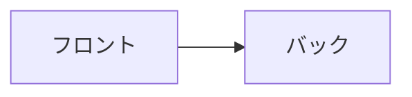
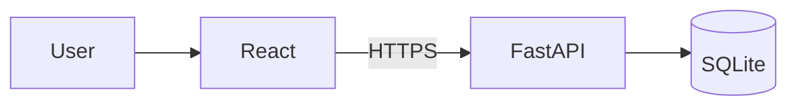
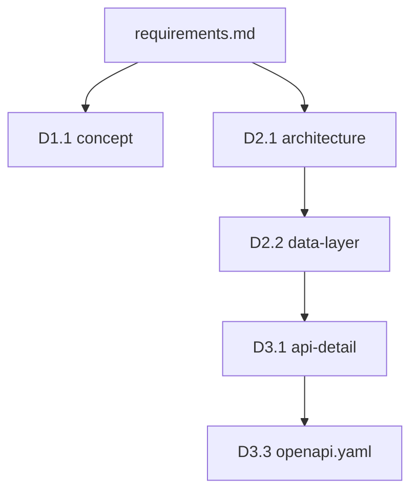
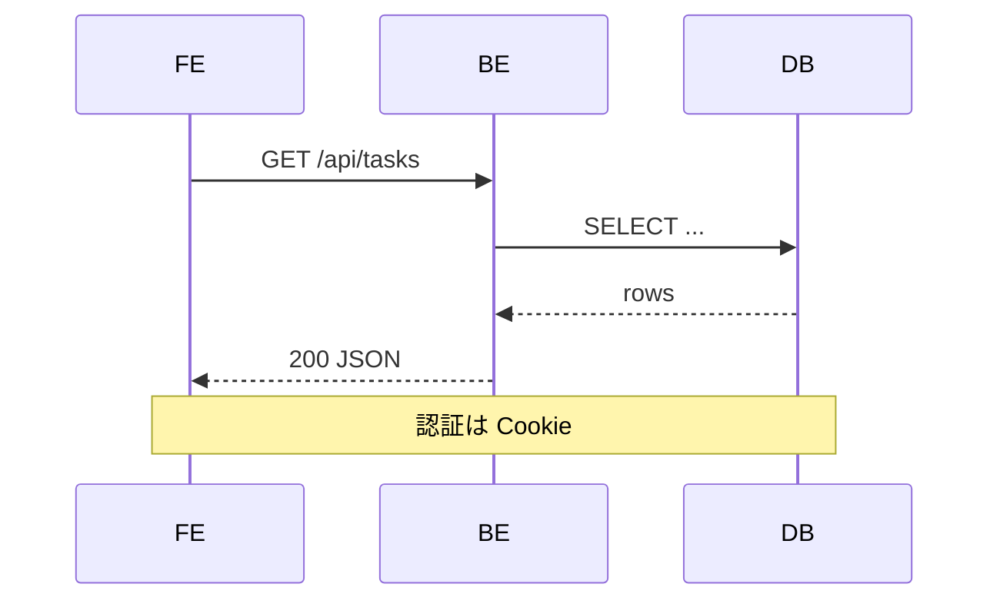
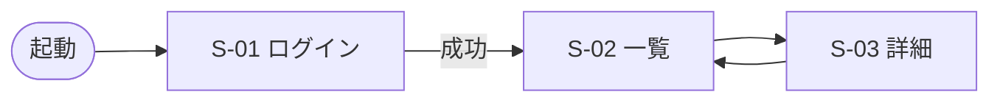

# Mermaid図の書き方・トラブル対応

設計書で Mermaid を使うときの実践ガイド。

## 使い所

| 図種 | 使う場面 |
|------|---------|
| `flowchart` | 構成図・画面遷移・簡易データフロー |
| `sequenceDiagram` | 時系列の通信（API 呼び出し・MCP 呼び出し） |
| `erDiagram` | データ層のエンティティ関連（任意） |
| `stateDiagram-v2` | UI 状態遷移（モーダル・フォーム）（任意） |

Mermaid が向かないもの: 複雑なネットワーク構成（画像にする）、ピクセル単位の画面レイアウト（frontend-design に委譲）。

## 頻出トラブルと回避

### 1. 特殊文字でパーサーエラー

**症状**: `<br/>`、`;`、`{}`、`"..."` が混在するとレンダリングが壊れる。

**回避**:
- 改行は `<br/>` ではなく短いメッセージに分割
- 特殊文字は `Note over` に逃がす

**悪い例**:
```
A->>B: POST /tasks<br/>{"title":"foo"};
```

**良い例**:
```
A->>B: POST /tasks
Note over A,B: body = JSON (title=foo)
```

### 2. 日本語ラベルの空白

**症状**: `flowchart` のラベルに全角スペースや記号を入れるとノード ID と混線。

**回避**: ラベルは `["..."]` で必ず引用符で囲む。



### 3. シーケンス図の `activate` 忘れ

非同期の同時処理や「応答を待ちながら別のことをしている」を表現したいとき、`activate`/`deactivate` を使うと明快になる。不要なら省略してよい。

### 4. `erDiagram` の表記揺れ

- カーディナリティ: `||--o{`、`}o--||` 等。方向と多重度を間違えやすい
- 関連名は小文字にすると衝突しにくい

### 5. ダークモード対応

多くのレンダラはダーク背景に対応するが、コントラスト不足になる色は避ける。ラベルに色指定（`classDef`）は必要最小限。

## テンプレ集

### 構成図（architecture.md で使用）



### 依存関係図（design/README.md で使用）



### シーケンス図（data-layer.md / api-detail.md で使用）



### 画面遷移図（docs/screens/index.md で使用）



## 動作確認

- Markdown プレビュー（VS Code / Obsidian / GitHub）で確認
- エラー時: ブラウザコンソールの Mermaid エラーを見る
- それでも壊れる場合: https://mermaid.live/ でコードを貼り付けて切り分け
