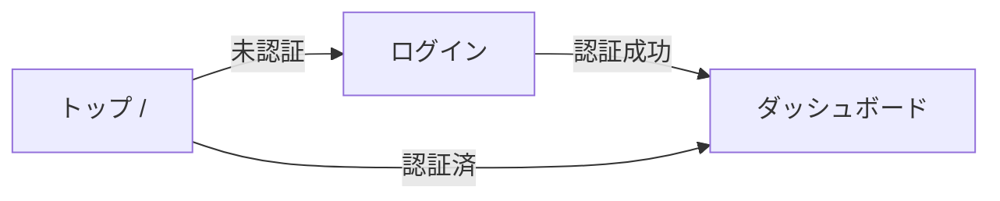

# 画面仕様書リバース生成スキル

React/Next.jsのフロントエンド実装コードを解析し、画面仕様書をMarkdownで自動生成する。
実装を正とし、コードに存在するものだけを仕様として記載する。推測や願望は書かない。

## フロー

1. **対象特定** — プロジェクト構造を把握し、画面（ページ）コンポーネントを一覧化する
2. **画面ごとの解析** — 各画面のコンポーネントツリーを辿り、全要素を抽出する
3. **仕様書生成** — テンプレートに沿って画面ごとにMarkdownを出力する
4. **画面遷移図** — 画面間の遷移関係をまとめた一覧を生成する
5. **レビュー** — 生成結果をユーザに報告する

## Step 1: 対象特定

プロジェクトのルーティング構成を特定する。

### Next.js（App Router）の場合
```
app/
├── page.tsx                    → /
├── login/page.tsx              → /login
├── dashboard/page.tsx          → /dashboard
├── products/
│   ├── page.tsx                → /products
│   └── [id]/page.tsx           → /products/:id
└── layout.tsx                  → 共通レイアウト
```
`app/`配下の`page.tsx`を持つディレクトリをすべて画面として列挙する。

### Next.js（Pages Router）の場合
`pages/`配下の`.tsx`ファイルを画面として列挙する（`_app.tsx`, `_document.tsx`は除外）。

### React（React Router等）の場合
ルーティング定義ファイル（`Router`, `Routes`, `Route`コンポーネントの使用箇所）を探し、パスとコンポーネントの対応を列挙する。

### 出力
まず画面一覧をユーザに提示し、対象範囲を確認する。全画面を対象にするか、一部だけかをユーザに選ばせる。

```
## 検出した画面一覧
| # | パス | コンポーネント | ファイル |
|---|------|--------------|---------|
| 1 | /    | HomePage     | app/page.tsx |
| 2 | /login | LoginPage  | app/login/page.tsx |
...
```

## Step 2: 画面ごとの解析

各画面について、以下の観点でコードを読み取る。コンポーネントの`import`を辿り、子コンポーネント・カスタムフック・ストア・API呼び出しまで再帰的に追跡する。

### 2.1 UI要素の抽出

画面内の全UI要素を分類して抽出する。

**入力要素**（ユーザーが操作するもの）:
- テキスト入力（`<input>`, `<textarea>`）— name, type, placeholder, required, バリデーション
- 選択（`<select>`, ラジオ, チェックボックス）— 選択肢の定義元、初期値
- ボタン（`<button>`, クリッカブル要素）— ラベル、onClick時の処理
- ファイルアップロード — 許可ファイル形式、サイズ制限
- 日付・時刻ピッカー — フォーマット、範囲制限

**出力要素**（画面が表示するもの）:
- テキスト表示 — 静的/動的、データソース
- リスト/テーブル — カラム定義、ソート/フィルタの有無、ページネーション
- 画像/メディア — ソース、alt属性
- ステータス表示 — バッジ、ラベル、条件分岐による出し分け
- 空状態/ローディング/エラー — 各状態の表示内容

**レイアウト要素**:
- ヘッダー/フッター/サイドバー
- タブ/アコーディオン/モーダル
- レスポンシブ対応（ブレークポイントによる変化があれば）

### 2.2 アクションの抽出

ユーザー操作とそれに対するシステムの振る舞いを特定する。

各アクションについて記録する項目:
- **トリガー**: 何をしたら発火するか（クリック、送信、入力変更、ページ読込み等）
- **処理内容**: 状態更新、API呼び出し、バリデーション、計算等
- **結果**: 画面更新、遷移、通知、ダウンロード等
- **エラー時**: エラーメッセージ、フォールバック動作

### 2.3 画面遷移の抽出

以下を手がかりに遷移先を特定する:
- `<Link href="...">` / `<a href="...">`
- `router.push()` / `router.replace()` / `navigate()`
- `redirect()` / `window.location`

各遷移について記録する:
- 遷移元と遷移先のパス
- 遷移条件（認証状態、権限、フォーム送信成功後など）
- パラメータの受け渡し（クエリパラメータ、パスパラメータ、state）

### 2.4 バックエンド通信の抽出

API呼び出しを特定する:
- `fetch()`, `axios`, `useSWR`, `useQuery`（TanStack Query）, Server Actions
- エンドポイントURL、HTTPメソッド
- リクエストボディ/パラメータの構造
- レスポンスの型定義（TypeScript型、Zodスキーマ等から）
- 認証ヘッダーの有無
- エラーハンドリング

### 2.5 ユースケースの抽出

解析した要素からユースケースを導出する。画面に存在する操作パスを網羅する。

ユースケースの抽出方針:
- **正常系**: 画面の主目的を達成するフロー（例: フォーム入力→送信→成功）
- **代替系**: 別の操作パス（例: フィルタ変更→再検索、ページネーション操作）
- **異常系**: エラー発生時のフロー（例: バリデーション失敗、API エラー）
- **境界系**: データがない場合、上限に達した場合、権限がない場合

## Step 3: 仕様書生成

各画面について以下のテンプレートでMarkdownファイルを生成する。

### 出力先
```
docs/screens/
├── index.md              ← 画面一覧・遷移図
├── home.md               ← / (トップページ)
├── login.md              ← /login
├── dashboard.md          ← /dashboard
├── product-list.md       ← /products
└── product-detail.md     ← /products/:id
```

ファイル名はパスをケバブケースに変換する。ユーザが出力先を指定した場合はそれに従う。

### 画面仕様テンプレート

```markdown
# 画面名

## 基本情報

| 項目 | 内容 |
|------|------|
| 画面ID | SCR-XXX |
| パス | /path/to/page |
| コンポーネント | ComponentName |
| ファイル | app/path/page.tsx |
| 認証 | 要/不要 |
| レイアウト | 使用レイアウト名 |

## 画面概要

この画面の目的・役割を1-2文で記述する。

## UI要素

### 入力要素

| # | 要素名 | 種別 | 必須 | バリデーション | 備考 |
|----|--------|------|------|--------------|------|
| I-1 | メールアドレス | text input | ○ | メール形式 | placeholder: "user@example.com" |
| I-2 | パスワード | password input | ○ | 8文字以上 | |
| I-3 | ログインボタン | button | - | - | disabled: 入力未完了時 |

### 出力要素

| # | 要素名 | 種別 | データソース | 条件 |
|----|--------|------|-------------|------|
| O-1 | ユーザ名 | text | API: /api/user | ログイン後表示 |
| O-2 | エラーメッセージ | alert | ローカルstate | バリデーション失敗時 |

### レイアウト構造

画面のレイアウト構成を簡潔に記述する。主要なセクション分けを箇条書きで示す。

## アクション

| # | アクション名 | トリガー | 処理内容 | 結果（成功時） | 結果（失敗時） |
|----|-------------|---------|---------|--------------|--------------|
| A-1 | ログイン | ログインボタン押下 | POST /api/auth/login | /dashboardへ遷移 | エラーメッセージ表示 |
| A-2 | パスワード表示切替 | アイコン押下 | state更新 | type属性をtext/password切替 | - |

## 画面遷移

### この画面への遷移元
| 遷移元 | 条件 | パラメータ |
|--------|------|----------|
| / (トップ) | 未認証時 | redirect=/dashboard |

### この画面からの遷移先
| 遷移先 | 条件 | パラメータ |
|--------|------|----------|
| /dashboard | ログイン成功 | - |
| /signup | 新規登録リンク押下 | - |

## API通信

### API-1: ログイン

| 項目 | 内容 |
|------|------|
| エンドポイント | POST /api/auth/login |
| リクエスト | `{ email: string, password: string }` |
| レスポンス（成功） | `{ token: string, user: { id, name, email } }` |
| レスポンス（エラー） | `{ error: string, code: number }` |
| 認証 | 不要 |

## ユースケース

### UC-1: 正常ログイン
1. ユーザがメールアドレスとパスワードを入力する
2. ログインボタンを押下する
3. POST /api/auth/login にリクエストが送信される
4. 認証成功し、/dashboard へ遷移する

### UC-2: ログイン失敗（認証エラー）
1. ユーザがメールアドレスとパスワードを入力する
2. ログインボタンを押下する
3. APIが401エラーを返す
4. 「メールアドレスまたはパスワードが正しくありません」と表示される

### UC-3: バリデーションエラー
1. ユーザがメールアドレスを未入力のまま送信する
2. 「メールアドレスは必須です」とフィールド下に表示される
3. APIリクエストは送信されない
```

### テンプレート適用時の注意

- **ID採番**: 入力要素はI-1から、出力要素はO-1から、アクションはA-1から、APIはAPI-1から、ユースケースはUC-1から連番を振る。画面IDはSCR-001から連番
- **データソースの明記**: 出力要素がどこからデータを取得するか（API、ストア、ローカルstate、props）を必ず記載する
- **条件の明記**: 表示条件、有効/無効条件、遷移条件を省略しない。コードに条件分岐があるなら仕様に書く
- **型情報**: APIのリクエスト/レスポンスはTypeScriptの型定義から転記する。型ファイルのパスも記載する
- **網羅性**: 画面に存在する全てのインタラクティブ要素とデータ表示をテーブルに含める。「等」「など」で濁さず、具体的に列挙する

## Step 4: 画面遷移図

全画面の遷移関係をまとめた`index.md`を生成する。

```markdown
# 画面一覧・遷移図

## 画面一覧

| 画面ID | 画面名 | パス | 認証 | 仕様書 |
|--------|--------|------|------|--------|
| SCR-001 | トップ | / | 不要 | [home.md](home.md) |
| SCR-002 | ログイン | /login | 不要 | [login.md](login.md) |

## 画面遷移図



## 共通コンポーネント

レイアウト、ヘッダー、フッターなど全画面で共有されるコンポーネントがあれば、ここに記載する。
```

## Step 5: レビュー

生成完了後、ユーザに以下を報告する:
- 生成した画面数とファイル一覧
- 解析中に判断に迷った箇所や、コードから読み取れなかった箇所の一覧
- 型定義が不明確だったAPIや、動的に生成されるルートなど注意事項

## 解析のガイドライン

### コンポーネントの追跡深度

ページコンポーネントから`import`を辿るが、以下で追跡を止める:
- UIライブラリの基本コンポーネント（MUI, shadcn/ui, Chakra UIなど）→ 使用方法のみ記載
- 汎用ユーティリティ関数 → 何をしているかだけ記載
- サードパーティのフック（useSWR, useQuery等）→ APIエンドポイントとオプションを記載

プロジェクト固有のコンポーネント・フック・ストアは中身まで読む。

### 認証・権限の判定

以下のパターンから認証要否を判定する:
- `middleware.ts`でのリダイレクト設定
- `useAuth`等の認証フック使用
- レイアウトコンポーネントでの認証ガード
- `getServerSession`等のサーバーサイド認証チェック

### 判断に迷うケース

- **動的インポート/遅延ロード**: コード分割されたコンポーネントも追跡対象。仕様書には「遅延ロード」と注記する
- **条件分岐で表示が大きく変わる画面**: 状態ごとにUI要素セクションを分ける（例: 「ログイン前」「ログイン後」）
- **モーダル/ドロワー**: 表示トリガーがある画面の仕様書内に含める。独立した画面としては扱わない
- **共通レイアウト要素**: index.mdの共通コンポーネントセクションに記載し、各画面からは「共通ヘッダー参照」と記載
